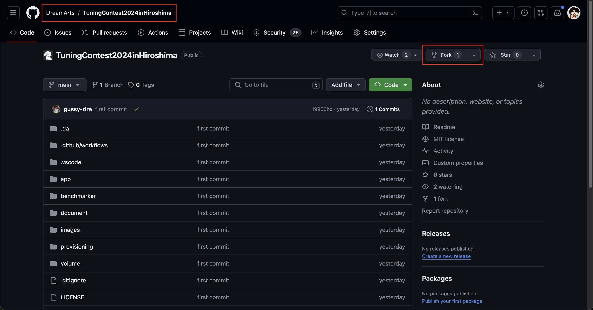

# 最初にやること

## 競技の開始

VM 環境での競技開始手順の説明をします。

### 必要なもの

- 秘密鍵: {環境 ID}\_ssh_key.pem という形式のファイル (各チームに配布予定です。)
- VM のドメイン: env-{環境 ID}.ftt2306.dabaas.net (上記秘密鍵の名前から特定できます。)

### 手順

1. このリポジトリを、チームの代表者 1 名の GitHub アカウントの Public リポジトリに fork してください。チューニングの成果物は fork したリポジトリの main ブランチにコミットしてください。
<div align="center">

</div>

2. 配布された秘密鍵を 各自の PC の任意の場所に置き、アクセス権限を適切に設定してください。

```
$ chmod 400 {秘密鍵のパス}
```

3. 秘密鍵に対応した VM のドメインを利用して、環境にログインしてください。

```
$ ssh -i {秘密鍵のパス} azureuser@{VMのドメイン}
```

4. ホームディレクトリにある entry.sh を実行し、fork したリポジトリの URL を入力してください。docker コンテナが起動し、初期データが投入されます。

```
$ bash entry.sh
forkしたリポジトリのURLを入力ください: https://github.com/your-name/TuningContest2024inHiroshima.git
```

「初期化に成功しました。」という出力がされていれば、無事に VM 環境での開発準備ができています。

5. リポジトリ内に移動し、実際に評価スクリプトを動かしてみてください。

```
$ cd TuningContest2024inHiroshima
$ bash run.sh
```

注意: fork 元の (DreamArts 所属の)リポジトリを使用することはできません。例えば、以下の URL を使うことはできません。  
`https://github.com/DreamArts/TuningContest2024inHiroshima.git`  
`https://github.com/DreamArts/TuningContest2024inHiroshima`

## 最初の採点終了後

- ここまでの手順が無事に終わると、運営にスコアが送信されます。
- この後は自由にチューニングを進めてもらって大丈夫です。
- 競技概要、レギュレーションについては下記のドキュメントをご参照ください。
  - [競技概要](../env)
  - [レギュレーション](../rules)
- 作業効率化のために、ローカル環境での開発環境の構築を行うことをお勧めします。  
  [ローカル環境での開発](../setup/00_Local.md)
